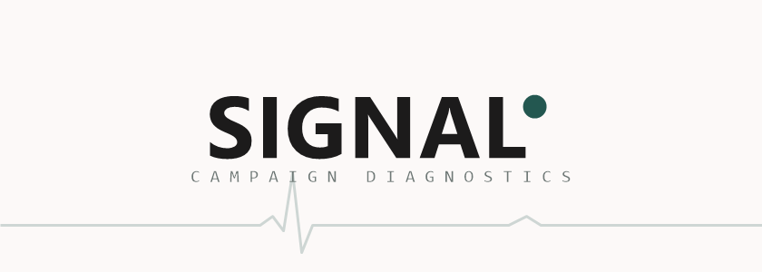
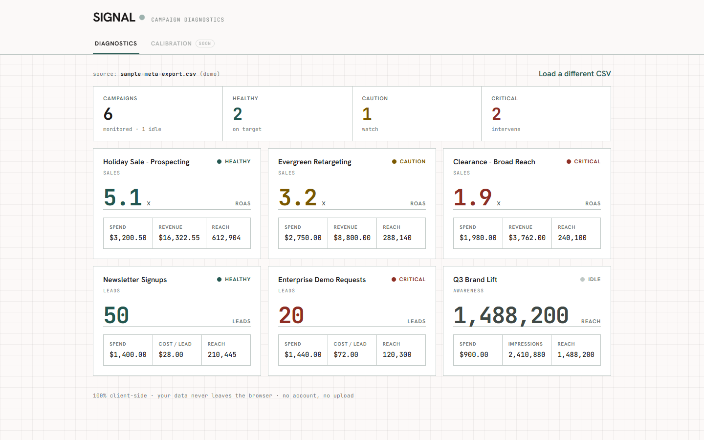

# 📡 SIGNAL — Campaign Diagnostics

<p align="center"></p>

<p align="center"><strong>HEALTHY · CAUTION · CRITICAL</strong></p>

<p align="center">
  
  
  
  <a href="https://signal-exe.netlify.app"></a>
</p>

**Signal** reads your Meta Ads export and diagnoses every campaign — *healthy, caution, or critical* — against your own thresholds.

If you run Meta ads and want a 3-second read on what's working and what's bleeding money, this is it.

> **Your data never leaves your browser.** 100% client-side — no upload, no account, no key.

<p align="center">
  <a href="https://signal-exe.netlify.app">Live Demo</a> ·
  <a href="#-how-to-use">How to use</a> ·
  <a href="#-troubleshooting">Troubleshooting</a> ·
  <a href="#-roadmap">Roadmap</a> ·
  <a href="#-license">License</a>
</p>



## 🩺 How to use

1. **Export a report** from Meta Ads Manager as **CSV** (Reports → Export). Include at least **Amount Spent**, **Results / Purchases**, **Purchases conversion value**, and **ROAS** — Signal auto-detects the columns, but it can only diagnose what you export.
2. **Open Signal** (the live demo, or run it locally — below).
3. **Drop the file** onto the dropzone, or click **Try sample data** to see it work first.
4. **Read the diagnosis.** Each campaign becomes an instrument: a big readout (ROAS for sales, lead count for leads), a status pip — teal *healthy*, amber *caution*, coral *critical* — and a summary strip tallying the account at a glance.

## 🖥 Run locally / self-host

Signal is a static site. It must be served over **HTTP** — opening `index.html` directly via `file://` won't work, because ES-module imports need a server.

```bash
# from the project root
python -m http.server 8000
```

Then open **<http://localhost:8000/>**. Any static host works (Netlify, GitHub Pages, `npx serve`).

- `index.html?demo=fixtures` — render the built-in fixture campaigns (handy for poking at the engine).

## ⚙️ How it works

A campaign flows through three pure engine steps:

```
raw rows  ──▶  parser   ──▶  scoring.diagnose(row, cfg)  ──▶  render
              (clean row)     (status: healthy/caution/critical/idle)
```

Every data source converges on **one clean-row contract** —

```js
{ campaign, objective, spend, impressions, reach, clicks,
  result, result_type, revenue, roas, cost_per_result }
```

— so the diagnosis and the UI never change when you add a source. Today's source is a CSV adapter (`engine/adapters/csvAdapter.js`); the Meta API adapter lands next and emits the same shape.

Signal is built as an **open-core engine** (`engine/` — pure, no secrets, no network) behind a future **private shell** (credentials, hosted Meta access). All Meta access goes through one port the shell will implement:

```js
fetchInsights(accountId, dateRange) -> rawRows
```

Swapping the live data source in is a **one-line change** at a single call site. Grading thresholds live in exactly one place (`engine/config.js`), ready for the Calibration tab to make editable.

## 🔧 Troubleshooting

- **"Couldn't find a spend column."** Your export is missing spend. Re-export from Ads Manager with **Amount Spent** included.
- **Numbers don't match Ads Manager.** Signal reads exactly what's in the CSV — check the **date range** and **attribution window** you exported with; late conversions shift the totals.
- **Blank page / nothing renders.** You opened it via `file://`. Serve it over HTTP (`python -m http.server 8000`) instead.
- **"Try sample data" fails.** Serve from the **project root** so `examples/` resolves.
- **A status looks off.** Defaults are **ROAS ≥ 4.0 healthy / < 2.5 critical** and **CPL ≤ 35 healthy / > 60 critical**. The **Calibration tab** (coming) makes these editable per objective.

## 🗺 Roadmap

- [x] **CSV diagnostics** — drop a Meta export, get the full diagnosis dashboard
- [ ] **Calibration tab** — live sliders to tune per-objective thresholds
- [ ] **Meta API live mode** — connect an account directly (private shell adapter)

## 📄 License

[MIT](LICENSE) © 2026 rolandriofrio7-dev
